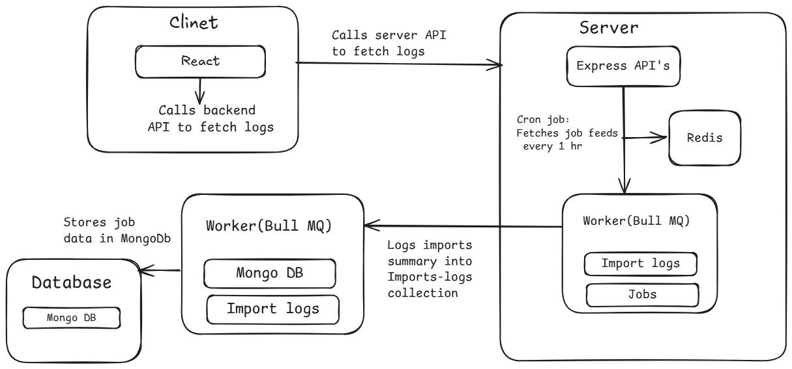

## System Architecture

### Overview

The Job Importer system is built to be easy to manage and grow in the future. It follows a clear structure where different parts handle different tasks:

* **Frontend**: A React-based UI that displays the import logs.
* **API Server**: A Node.js + Express server that handles API requests.
* **Background Processing**: A BullMQ-based background worker that processes job data.
* **Database**:  MongoDB is used to store job records and logs.
* **Queue**: Redis is used to manage background tasks using BullMQ.

---

## Component Design

### 1. Cron Job

* Runs automatically every 1 hour (you can change the interval).
* Fetches job data from multiple external feed URLs.
* Converts XML data to JSON using xml2js.
* Sends each job to the Redis queue (BullMQ) for processing.

### 2. Worker (BullMQ)

* Listens for new jobs in the Redis queue.
* Checks if the job already exists in the database using guid.
* If it exists, updates the record; otherwise, creates a new one.
* Tracks stats like total, new, updated, failed jobs
* When all jobs are processed, it saves a summary log to MongoDB.

### 3. API Routes

* `GET /api/import-logs` : Sends all import logs to the frontend so they can be shown in the UI.

### 4. Frontend UI

* Shows the import logs in a table with pagination (using Material UI).
* Gets data from the backend API and displays it cleanly.

---

## Key Decisions

### ✔️ Queue-Based Architecture

* Keeps job processing separate from normal API requests.
* Helps the system handle more load without slowing down.

### ✔️ Redis (BullMQ) for Queues

* Fast and reliable for managing background jobs.
* Automatically handles retries, events, and job delays.

### ✔️ MongoDB

* Easy to store and update job data because of flexible schema.
* Great for working with both new and existing job entries.

### ✔️ Material UI

* Easy-to-use UI components.
* Provides built-in features like table pagination and sorting.
---

## Potential Improvements

* Add search and filter options on the frontend to quickly find specific logs.
* Add a retry feature to automatically try importing again if a URL fails
* Add authentication so only admins can view or manage import logs
* Add an option to download logs as CSV or Excel files for reporting or backup.

---

## System Diagram

Below is a visual overview of the Job Importer system architecture:

---
